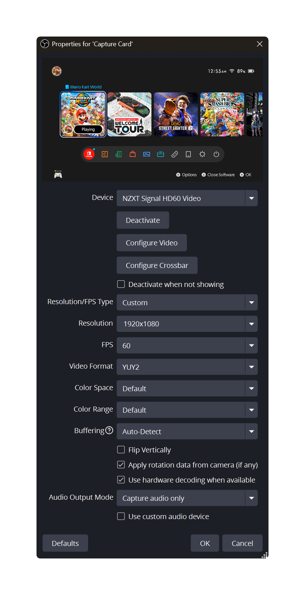

# Capture Card Setup

## Instructions

1. In the **Sources** dock, double click on the :camera: **Capture Card** source.

<figure><figcaption></figcaption></figure>

2. Click on the **Device** dropdown menu and select the name of the capture card you're using from the list and set the following settings to the ones shown below.

<figure><figcaption></figcaption></figure>


If you've selected the correct device, video output of the Switch connected to the capture card should show up on the video preview above.

If you can't find the device name of the capture card from the dropdown list, make sure the capture card's USB cable is plugged in properly to your computer and try again.


3. Once you've confirmed the video output is showing up correctly, click on **OK**.

