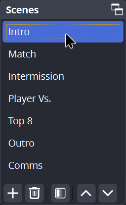

# Going Live

You're almost done with the setup and be ready to stream Wolfie Wars to Twitch and YouTube! Before you click on that **Start Streaming** button, make sure that you follow these general practices before going live.

***

## Intro Scene

Make sure you're on the **Intro** scene first. To do that, simply click on **Intro** from the **Scenes** dock in OBS Studio.

<figure><figcaption></figcaption></figure>

Entering this scene will take you and the viewers with the "STARTING SOON" graphic.

<figure><figcaption>
<strong>Intro</strong> scene
</figcaption></figure>

Use this scene as a cover for yourself to do any last-minute changes and checks to the stream setup, making sure that they're ready to go.

***

## Starting the Stream

1. _Now_ you can click on **Start Streaming** button, which is located on the bottom right side of the OBS window. You are now live on [**Twitch**](https://twitch.tv/sbusmash).
2. To start the stream on YouTube, click on the :wireless: **Stream** button for "SBU Smash" from the **Aitum Multistream** dock. You are now live on [**YouTube**](https://youtube.com/@sbusmash) as well when the button turns green.

<figure><figcaption>
<strong>Aitum Multistream</strong> dock
</figcaption></figure>

3. Stay on the **Intro** scene for around one minute AND make sure that the players on the stream setup and ready to play. Let them know when you're ready to stream too.
4. Once everything is ready, you can now switch to the **Match** scene to show gameplay to the viewers.

<figure><figcaption>
<strong>Match</strong> scene
</figcaption></figure>

***

## Intermission Scene

When you switch to the **Intermission** scene, you will be showing the "WE'LL BE RIGHT BACK" graphic to the viewers.

<figure><figcaption>
<strong>Intermission</strong> scene
</figcaption></figure>

Use this scene as a cover for troubleshooting purposes or when nothing is happening in the middle of the stream. Just don't forget to switch back to the **Match** scene when resuming gameplay.

***

## Outro Scene

When you switch to the **Outro** scene, you will be showing the "THANKS FOR WATCHING" graphic to the viewers.

<figure><figcaption>
<strong>Outro</strong> scene
</figcaption></figure>

Use this scene to inform the viewers that the tournament has finished. Stay on this scene for around one minute before stopping the stream.

***

## Stopping the Stream

1. To stop the stream, click on **Stop Streaming**.


Wait until the **Stop Streaming** button changes back to **Start Streaming**. That will be your indicator that the stream has stopped successfully.

However, keep in mind that this button only stops the Twitch stream.


2. To stop the stream on YouTube, click on the :wireless: **Stream** button for "SBU Smash" from the **Aitum Multistream** dock. You have stopped streaming to YouTube once the button becomes inactive.
3. Close OBS Studio.
