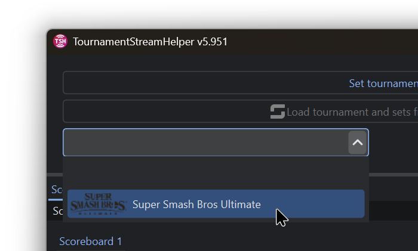
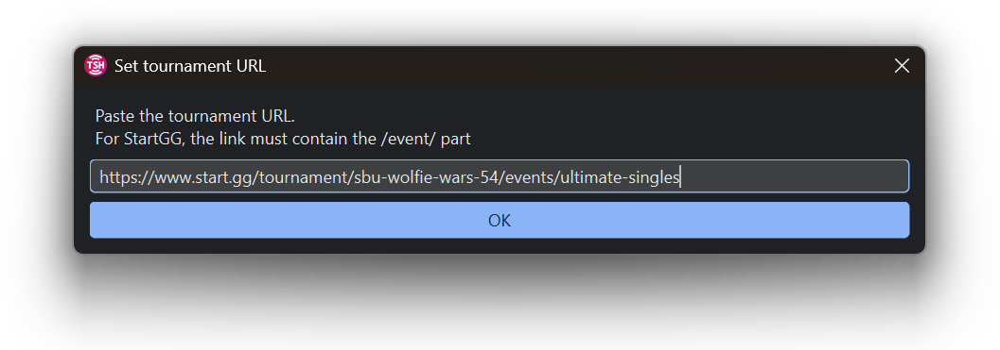

# TournamentStreamHelper Setup

## Setting up Files


I recommend placing all extracted files into a single folder to stay organized. Let's call this folder the "working folder" to simplify things. For example, create a :file\_folder: `Wolfie Wars` folder for everything and put it somewhere in your computer that is quicker for you to access.


1. Open the :file\_cabinet:`TournamentStreamHelper-x.xx.zip` archive and extract (dragging out) :file\_folder: `TournamentStreamHelper-x.xx` to :file\_folder: `Wolfie Wars`.
2. Rename the folder to :file\_folder: `TournamentStreamHelper`.
3. Extract the contents from :file\_cabinet: `TournamentStreamHelper.zip` (downloaded from the stream assets drive) to :file\_folder: `Wolfie Wars`. Replace all files when prompted.

***

## Running TSH and Downloading Game Assets

1. Open the :file\_folder: `TournamentStreamHelper` folder and run the **TSH** executable.


If you got a Windows Firewall pop-up, click on **Show more** and make sure both networks are ticked, then click **Allow**.


<figure><figcaption></figcaption></figure>

2. On the top-right side of the TSH window, click on the three stripes menu and select :arrow\_down: **Download assets**.

<figure><figcaption></figcaption></figure>

3. Select **Super Smash Bros Ultimate** from the dropdown list, then click on the first asset pack and then **Download**.

<figure><figcaption></figcaption></figure>

**(Optional)** Once the base asset pack is downloaded, you can now select and download any additional asset packs. I recommend downloading at least the **Full** asset pack for Smash Ultimate.


Be careful with downloading multiple packs at once as the download size will be very large and it will take a while to finish depending on your internet speed. However, you will not be able to use TSH at all until the download is complete.


4. Once the downloads are done, close the Download assets window.
5. On the top-left side of TSH, click on the empty dropdown menu and select **Super Smash Bros Ultimate**.

<figure><figcaption></figcaption></figure>

***

## Linking Start.gg to TSH

1. Click on **Set tournament** and paste the **start.gg** link of the latest Wolfie Wars event in the text field. Make sure to paste the correct link as described in the window, then click **OK**.

<figure><figcaption></figcaption></figure>

2. Navigate to the **Tournament Info** tab and click on **Download tournament icon** to change the default icon to the one set for the tournament in start.gg.

<figure><figcaption></figcaption></figure>
