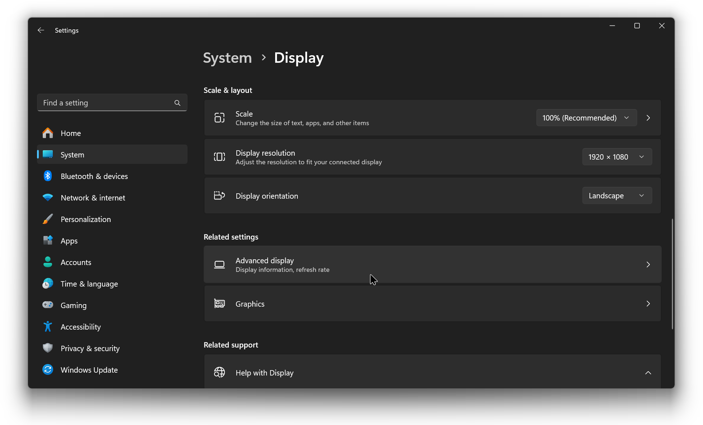
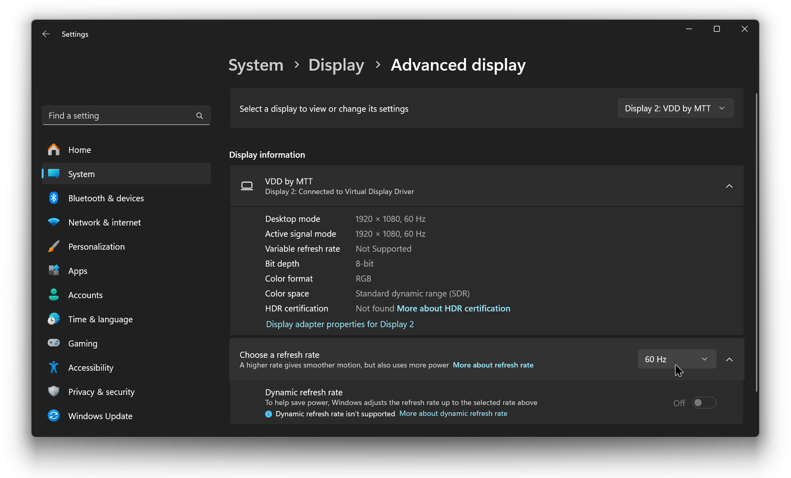

# Venue A/V System Setup

## External Display Settings

1. On the streaming PC, make sure you're extending to the external display by pressing **Windows key + P** on the keyboard and selecting the **Extend** option.

<figure><figcaption></figcaption></figure>

2. Open the **Settings** app, go to **System** and then **Display**.
3. Click on the rectangle with a **2** inside it and set the resolution to **1920x1080**.

<figure><figcaption></figcaption></figure>

4. Scroll all the way down and click on **Advanced display** (or **Advanced display settings** if you're on Windows 10).

<figure><figcaption></figcaption></figure>

5. Select **Display 2** and then change the refresh rate to **60 Hz**.

<figure><figcaption></figcaption></figure>

***

## Creating a Fullscreen Projector in OBS Studio

In OBS Studio, right-click on the preview, then click on **Fullscreen Projector (Preview)**, and select the second display from the list.

<figure><figcaption></figcaption></figure>

The content you see on the preview should now be mirrored to the external display for everyone to see.


Keep in mind that the audience will see **exactly** what you see on the preview, meaning that any changes you make in the program will also reflect on the external display in real time.

