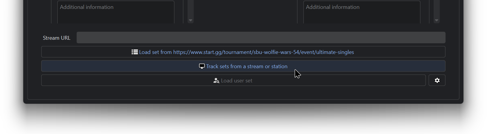
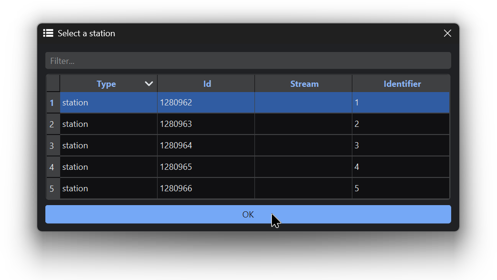

# Managing the Scoreboard

**TournamentStreamHelper (TSH)** is a powerful tool that has many useful features for showing game match data to livestreams.

The feature that we are mainly interested is its tight integration with start.gg. This means that you can just update the match scores and player data from start.gg and TSH will **synchronize** with those updates and show them to the scoreboard(s) **automatically**, reducing the need for manual intervention from the streaming PC.

***

## Initial Setup

Make sure that TSH is set up to fetch data from the start.gg link of the tournament of your choice.


[tournamentstreamhelper-setup.md](tournamentstreamhelper-setup.md)


***

## Track a Match from a Start.gg Station

1. At the bottom of the TSH window, click on :desktop: **Track sets from a stream or station.**

<figure><figcaption></figcaption></figure>

2. Select the station with the **Identifier** listed as "1". This is known as Station 1 from start.gg and is typically represented as the stream station. Then click **OK**.

<figure><figcaption></figcaption></figure>

As you can see, TSH has fetched the match data from Station 1 and filled it in to show on the scoreboard:

<figure><figcaption>
To keep the scoreboard data up-to-date, TSH is fetching updates from start.gg every 5 seconds.
</figcaption></figure>

3. Set the **BEST OF** number to **3** if it's a regular match, or to **5** for a Top 8 match. Unfortunately, start.gg or TSH cannot determine this automatically.

<figure><figcaption></figcaption></figure>

Any match updates you make from start.gg will automatically be reflected to TSH.

<figure><figcaption></figcaption></figure>
