# OBS Studio Setup

## Installing OBS Studio and Plugins



1. Install OBS by opening `OBS-Studio-XX.X.X-Full-Installer-x64.exe` downloaded earlier from [prerequisites.md](prerequisites.md "mention"). Skip this step if you have it installed already.



Soon:tm:




To install plugins, OBS Studio must be closed and not be running in the background.


2. Install the [Aitum Multistream](https://aitum.tv/download/multi/) plugin.

***

## Setting Up the Wolfie Wars Assets and Scenes

1. Extract the contents from :file\_cabinet: `Fonts.zip`, :file\_cabinet: `Logos.zip`, :file\_cabinet: `OBS Profiles.zip`, and :file\_cabinet: `Videos.zip` to :file\_folder: `Wolfie Wars`.

Your :file\_folder: `Wolfie Wars` folder should look like this at this point:

<figure>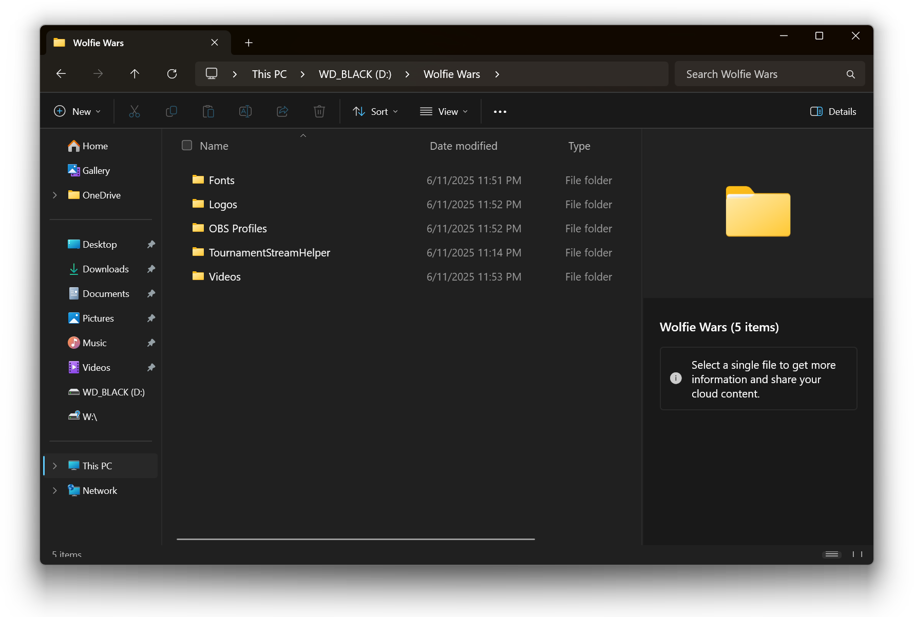<figcaption></figcaption></figure>

2. Open the :file\_folder: `Fonts` folder and install all font files by **right-clicking** on them -> :arrow\_down: **Install**.
3. Run **OBS Studio (64bit)** from the Start Menu. Skip the initial setup by pressing **Cancel**.
4. At the top left corner of the OBS window, click on **Profile -> Import**.

<figure>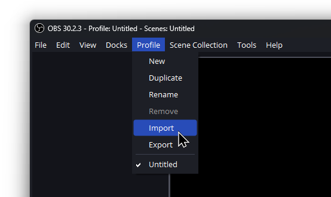<figcaption></figcaption></figure>

5. Select the :file\_folder: `Wolfie_Wars` folder from :file\_folder: `OBS Profiles` and click **Select Folder**.

<figure>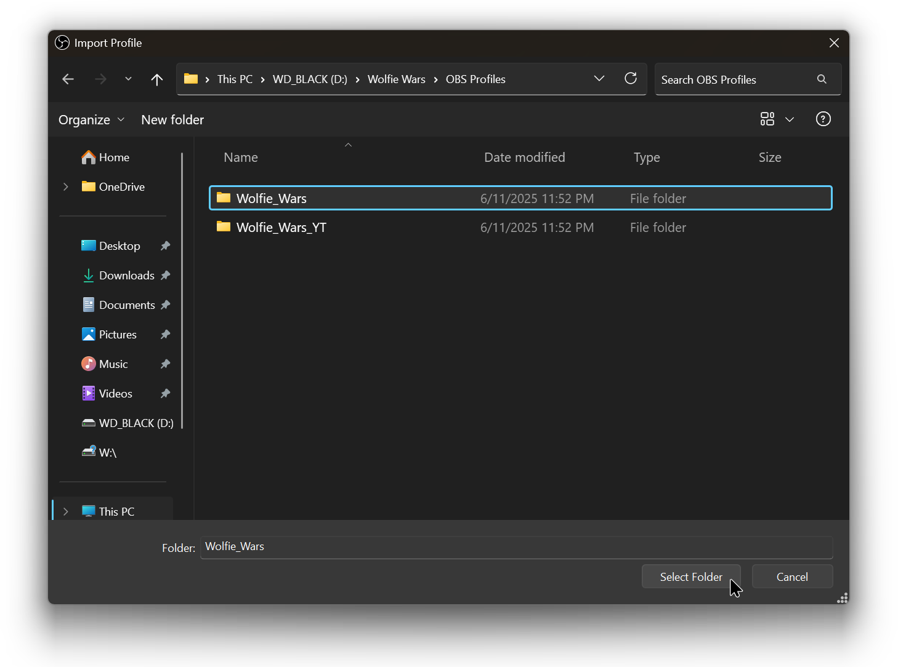<figcaption></figcaption></figure>

6. Select **Wolfie Wars** from the **Profile** menu.

<figure>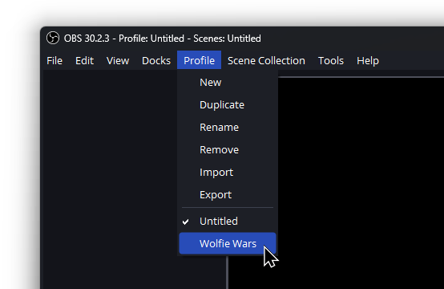<figcaption></figcaption></figure>

7. At the top left corner of the OBS window, click on **Scene Collection -> Import**.

<figure>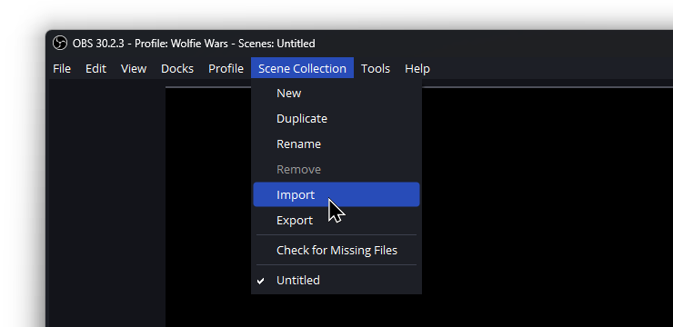<figcaption></figcaption></figure>


If the following window shows up on your screen, select **No**.


<figure>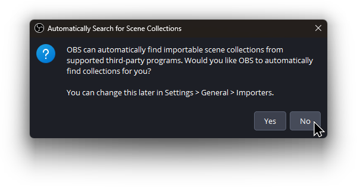<figcaption></figcaption></figure>

8. Click on the `...` button.

<figure>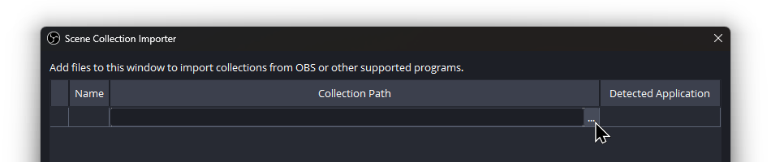<figcaption></figcaption></figure>

9. Select the :page\_facing\_up:`Wolfie_Wars.json` file from :file\_folder: `OBS Profiles` and then click **Open.**

<figure>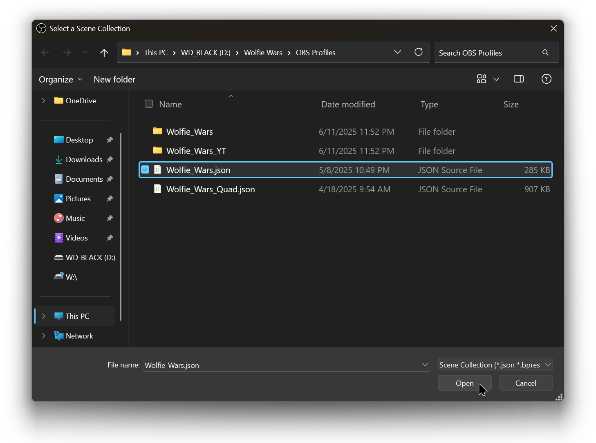<figcaption></figcaption></figure>

10. Click on **Import**.
11. Select **Wolfie Wars** from the **Scene Collection** menu.

<figure>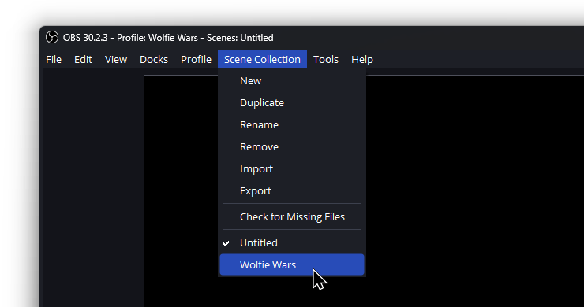<figcaption></figcaption></figure>


Since the placement of the stream setup files can differ from computer to computer, the following window may show up on your screen.


<figure>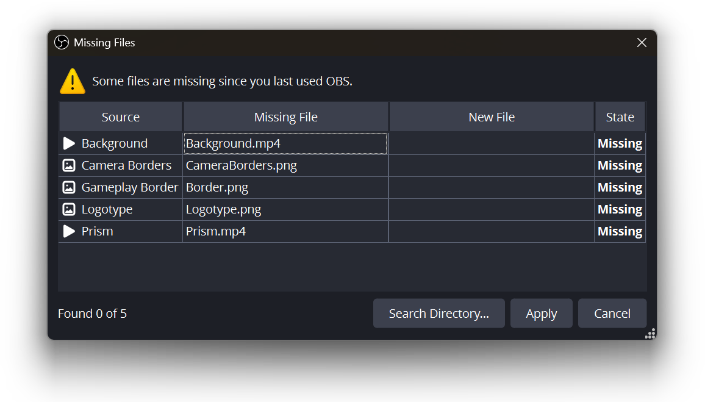<figcaption></figcaption></figure>

You can fix this by clicking on **Search Directory...** and selecting the :file\_folder: `Videos` folder.

As you can see some of the files were found but not all.

<figure>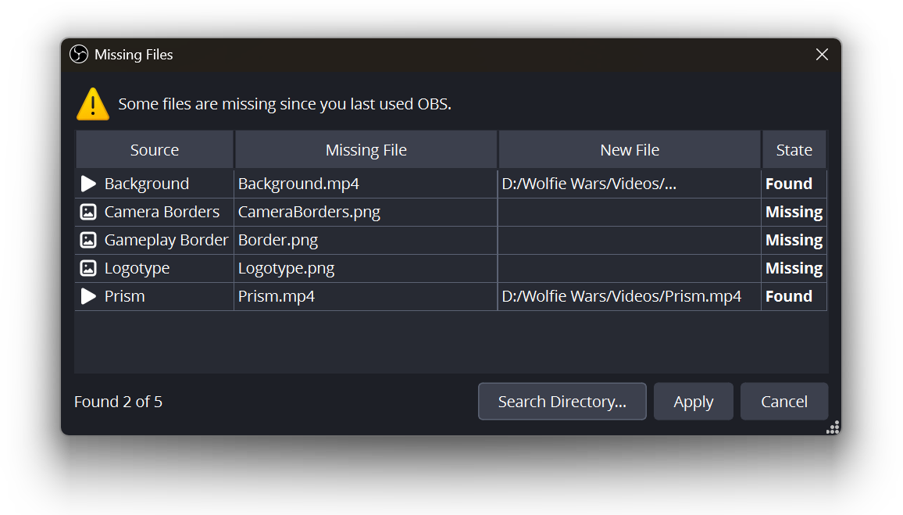<figcaption></figcaption></figure>

For the rest of the missing files, we can manually specify their location by clicking on `...` for each missing file.

<figure>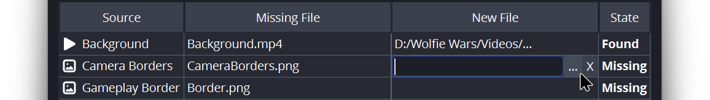<figcaption></figcaption></figure>

12. Use the following table to find and select the right files.

<table><thead><tr><th width="158.3333740234375">Source</th><th>File location</th></tr></thead><tbody><tr><td>Camera Borders</td><td><code>TournamentStreamHelper/layout/scoreboard_vgbootcampy/CameraBorders.png</code></td></tr><tr><td>Gameplay Border</td><td><code>TournamentStreamHelper/layout/scoreboard_vgbootcampy_waiting/Border.png</code></td></tr><tr><td>Logotype</td><td><code>Logos/Logotype.png</code></td></tr></tbody></table>

13. Once all missing files States are marked as "Found", click on **Apply**.


To make sure you're on the right profile and scene collection, you can simply check the OBS window title.



At this point, your OBS window should look like this:

<figure><figcaption></figcaption></figure>
